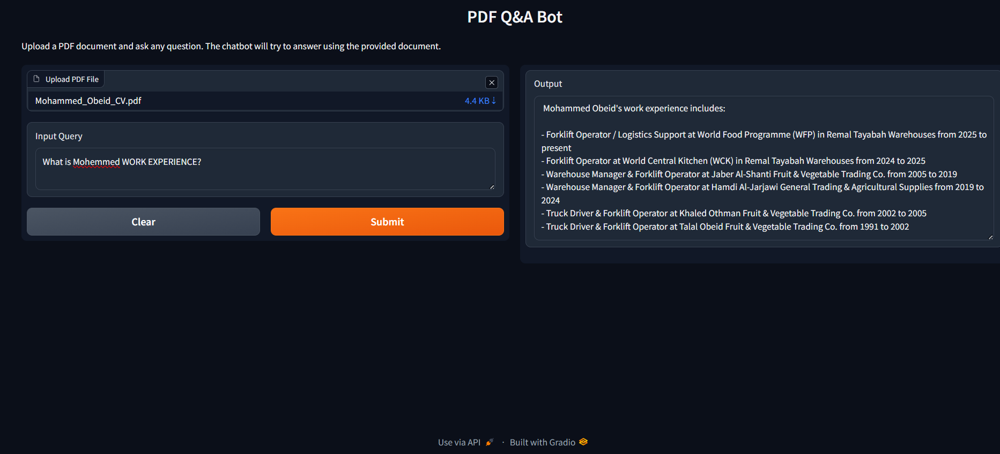

# 📄 PDF RAG Question Answering Bot

A Retrieval-Augmented Generation (RAG) application that allows users to upload a PDF document and ask questions about its content.

This project was developed as part of the **Generative AI Engineering with LLMs** learning track and demonstrates a complete document-question-answering pipeline using LangChain, IBM watsonx.ai, ChromaDB, and Gradio.

## 🚀 Features

- Upload a PDF document
- Extract text with `PyPDFLoader`
- Split documents into overlapping chunks
- Generate embeddings with IBM watsonx.ai
- Store embeddings in ChromaDB
- Retrieve relevant document chunks using similarity search
- Generate answers using an IBM Granite LLM
- Interact through a Gradio web interface

## 🧠 Architecture

```text
PDF Document
     ↓
PyPDFLoader
     ↓
RecursiveCharacterTextSplitter
     ↓
IBM watsonx.ai Embeddings
     ↓
Chroma Vector Database
     ↓
Retriever
     ↓
RetrievalQA
     ↓
IBM Granite LLM
     ↓
Gradio Interface
```

## 🛠️ Technologies

- Python
- LangChain
- IBM watsonx.ai
- IBM Granite
- ChromaDB
- Gradio
- PyPDF

## 🤖 Models

### LLM

```text
ibm/granite-4-h-small
```

### Embedding Model

```text
ibm/granite-embedding-278m-multilingual
```

> **Note:** The original course lab referenced an older Slate embedding model. This implementation uses the currently supported IBM Granite embedding model for compatibility with the active watsonx.ai endpoint.

## 📂 Project Structure

```text
watsonx-langchain-pdf-rag/
│
├── qabot.py
├── requirements.txt
├── README.md
├── LICENSE
├── .gitignore
│
└── screenshots/
    └── qa_bot.png
```

## ⚙️ Installation

Clone the repository:

```bash
git clone https://github.com/HamzaObaid35/watsonx-langchain-pdf-rag.git
cd watsonx-langchain-pdf-rag
```

Create a virtual environment:

```bash
python -m venv venv
```

Activate the virtual environment.

### Windows

```bash
venv\Scripts\activate
```

### Linux / macOS

```bash
source venv/bin/activate
```

Install the required dependencies:

```bash
pip install -r requirements.txt
```

## ▶️ Run the Application

Run the application with:

```bash
python qabot.py
```

The application is configured to run on port:

```text
7860
```

## 📖 How It Works

1. The user uploads a readable PDF document.
2. `PyPDFLoader` extracts the text from the PDF.
3. `RecursiveCharacterTextSplitter` divides the document into chunks of 1000 characters with an overlap of 200 characters.
4. IBM watsonx.ai generates vector embeddings for the document chunks.
5. ChromaDB stores the generated embeddings.
6. The vector-store retriever searches for chunks that are most relevant to the user's question.
7. `RetrievalQA` combines the retrieved context with the user's query.
8. The IBM Granite LLM generates an answer based on the retrieved document content.
9. The final answer is displayed through the Gradio interface.

## 📸 Demo



## 🎓 Project Context

This repository is an educational implementation created while completing the final RAG project in the **Generative AI Engineering with LLMs** learning track.

The project demonstrates the integration of:

- Document loading
- Text splitting
- Embedding generation
- Vector databases
- Semantic retrieval
- Retrieval-Augmented Generation (RAG)
- LLM-based question answering
- Gradio user interface

## 🔧 Compatibility Update

While completing the project, the original embedding model referenced by the course was no longer supported by the active IBM watsonx.ai endpoint.

The implementation was therefore updated to use:

```text
ibm/granite-embedding-278m-multilingual
```

instead of the older Slate embedding model.

This modification keeps the application functional while preserving the intended RAG architecture of the original project.

## ⚠️ Notes

- The application is best suited for readable PDF documents.
- Very large PDF files may require additional optimization, such as batch embedding or persistent vector storage.
- Do not commit API keys, IBM Cloud credentials, `.env` files, or virtual environments to GitHub.
- The `skills-network` project configuration is intended for the IBM Skills Network lab environment.
- Running the project outside the Skills Network environment may require your own IBM Cloud credentials and watsonx.ai project configuration.

## 📄 License

This project is intended for educational and portfolio purposes.

See the [LICENSE](LICENSE) file for license details.
